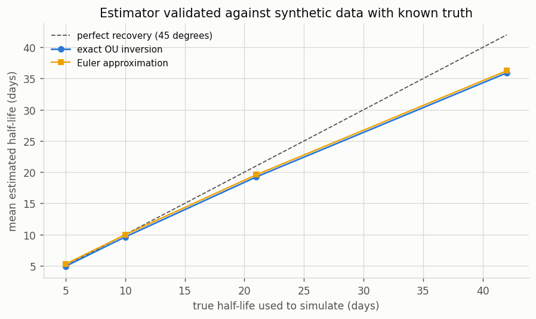
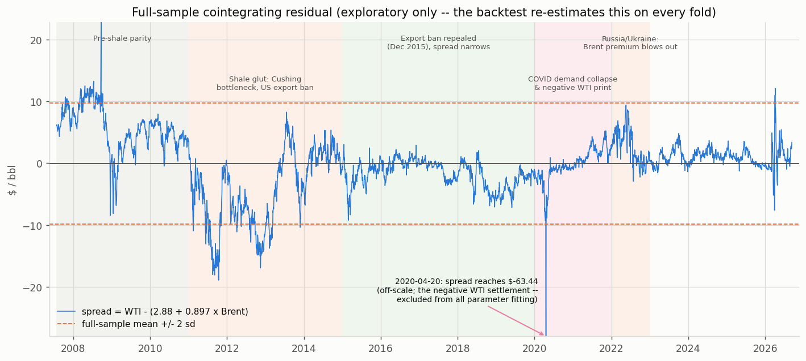
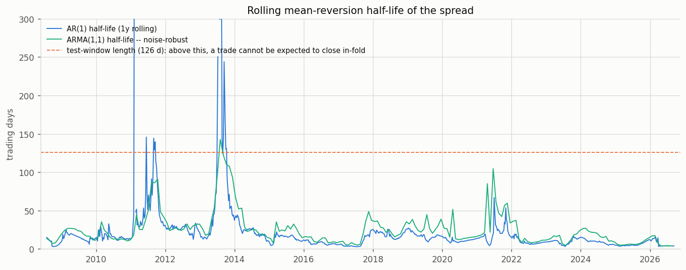
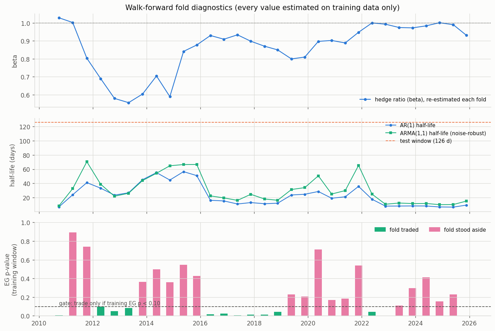
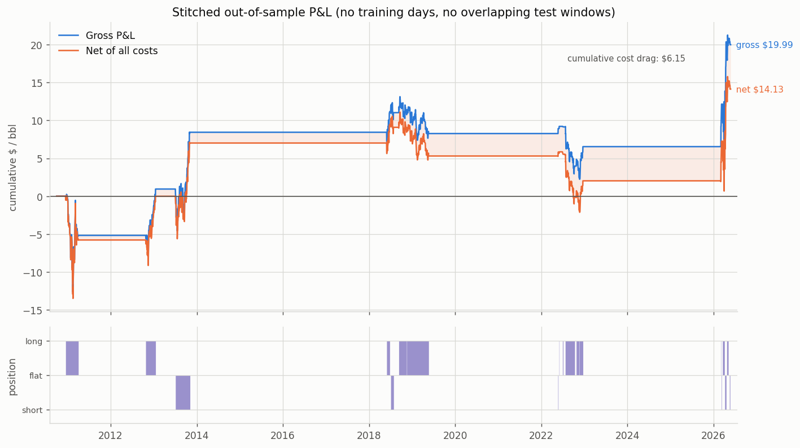
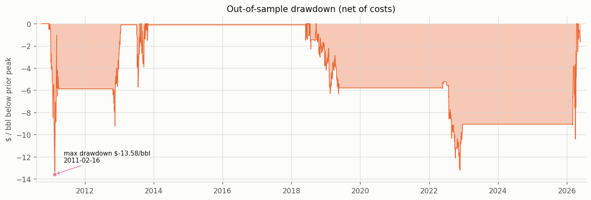
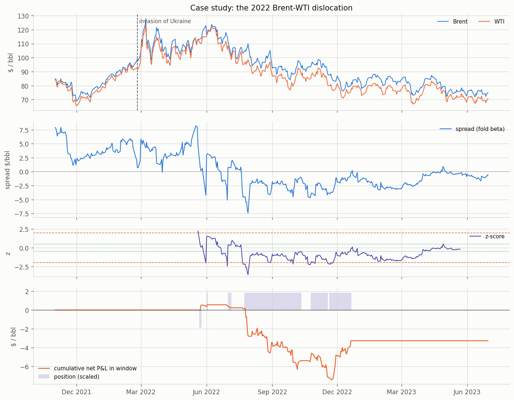

# Statistical Arbitrage via Cointegration in Brent–WTI

A research study of whether the economic linkage between the two benchmark crude
oil grades is statistically robust enough, and stable enough, to trade — tested
under a purged walk-forward protocol with explicit transaction and futures-roll
costs.

**Headline result: no reliable tradeable edge is demonstrated.** The pair is
genuinely cointegrated over the full sample and the strategy makes money gross,
but the net out-of-sample Sharpe is **0.18 with a 95% confidence interval of
[−0.32, 0.69]** — statistically indistinguishable from zero — and the result does
not survive a change in the training-window length. The reasoning behind
reporting that rather than a more flattering number is the substance of this note.

Two findings along the way are worth more than the headline:

- **Ignoring futures rolls would have more than tripled the apparent Sharpe**
  (0.18 → 0.58), multiplied P&L 4.6× ($14 → $66/bbl) and turned a 53% hit rate
  into 89%. This accounting artefact is common in naive backtests run on
  continuous front-month data.
- **The standard AR(1) half-life estimator collapses under microstructure
  noise** — reporting 0.4 days for a process with a true 30-day half-life — and
  the obvious fix (more AR lags) fails for a structural reason.

---

## 1. Hypothesis and economic rationale

WTI and Brent are both light, sweet crude, substitutable in most refineries, tied
together by physical arbitrage: pipeline capacity from Cushing to the US Gulf
Coast, export terminal capacity, and tanker freight. If the price gap exceeds the
cost of moving a barrel between pricing points, someone moves the barrel.

That mechanism implies **cointegration** rather than mere correlation: each price
is individually a random walk driven by global supply and demand shocks, but a
particular linear combination should be pulled back toward an equilibrium set by
transport economics.

The key asymmetry, which drives the 2022 case study: **Brent is waterborne** and
clears against global seaborne supply and demand, while **WTI is landlocked** at
Cushing, Oklahoma and reaches the world only through finite Gulf Coast
infrastructure. When that infrastructure binds — or when a shock reprices
seaborne crude specifically — the equilibrium itself moves.

---

## 2. Data

| | |
|---|---|
| Instruments | WTI front-month (`CL=F`), Brent front-month (`BZ=F`) |
| Source | Yahoo Finance, daily settlements |
| Sample | 2007-07-30 → 2026-09-11 (4,758 days with both legs) |
| Units | **Raw price levels, not logs** |

Brent history on Yahoo begins 2007-07-30, setting the start of the common sample.
Days where either leg did not print are **dropped, not forward-filled** — a
forward-filled price implies a zero return on a day the market actually moved,
which understates spread volatility and therefore inflates both the z-scores and
the Sharpe ratio.

We use **price levels rather than logs** for a specific reason: WTI settled at a
negative price in 2020, and the logarithm of a negative number does not exist.
Any log-based study of this pair must either start after 2020 or silently discard
the most informative stress event in the sample.

### 2.1 Known data issue: the 2020-04-20 negative print

On 20 April 2020 WTI settled at **−$37.63/bbl**. This is a real print, not an
error: storage at Cushing had effectively filled, and the expiring May contract
obliged its holder to take physical delivery with nowhere to put it.

**How it is handled:**

- **Excluded from every parameter-estimation step** — the OLS hedge ratio, ADF,
  Johansen, and the OU fit — in any window containing it.
- **Retained in the raw series** used for plotting and for marking positions to
  market. The strategy must live through the event; it just must not *learn
  from* it.
- Implemented as a single explicit mask (`data.estimation_mask`) that every
  estimator consumes, rather than each module quietly filtering on its own.
- In the OU fit, **both** regression pairs touching the excluded date are dropped
  (the transition into it and out of it) — a difference computed against a
  corrupted price is itself corrupted.

**Why exclusion is necessary rather than fastidious:** every estimator here is a
least-squares-type estimator with an unbounded influence function. One
observation at −$37 in a series otherwise living in [$19, $146] does not nudge
the hedge ratio; it can dominate it.

The walk-forward audit confirms the date falls inside the training span of folds
19–24 and is masked out of all of them. Excluding 2020-04-21 as well (the $10.01
follow-on print) changes the net result by less than a cent — reported as a
robustness row rather than adopted quietly.

**This reflects a genuine data limitation, not a minor nuisance.** A real desk rolls
several days before expiry and would never have held that contract. The negative
print is an artefact of *naive continuous front-month construction* — which turns
out to be the larger problem.

### 2.2 The bigger data issue: futures rolls

A continuous front-month series is not a tradeable instrument. When the front
contract expires, the series **jumps** to the next contract's price. That jump
appears in the data as a price change but is a **change of instrument, not P&L**.

Roll dates are reconstructed from each exchange's published expiry rules:

- **WTI (CL):** trading terminates 3 business days before the 25th calendar day
  of the month preceding delivery → rolls around the 21st–23rd.
- **Brent (BZ):** trading ceases on the last business day of the second month
  preceding delivery → rolls on the first business day of the month.

Measured effect: flagged roll days move **21% (WTI) and 35% (Brent)** more than
ordinary days. The discontinuity is real and material (~10% of all days).

**The effect size is large:**

| Roll treatment | Net Sharpe | Net P&L | Hit rate |
|---|---|---|---|
| **Neutralised (this study)** | **0.182** | **$14.13** | 52.6% |
| Naive — book the jump as P&L | 0.575 | $65.69 | 89.5% |

A backtest that simply differences a continuous series reports a Sharpe more than
**3× higher** and a P&L **4.6× larger**, with an 89% hit rate that looks like a
world-class strategy. It is almost entirely an accounting artefact.

**Two bugs found and fixed here**, both documented because they are easy to
repeat:

1. **Leg-wise neutralisation is wrong.** The first implementation zeroed only the
   *rolling* leg, reasoning the other leg's move is genuine. True of the leg,
   false of the **spread**: zeroing one leg leaves the day's P&L equal to the
   other leg's *unhedged* move, silently converting a market-neutral position
   into a directional bet on ~10% of days. On 2022-08-01 the spread genuinely
   moved +$5.25 while leg-wise neutralisation recorded −$4.73 — a $10 single-day
   error that flipped one 2022 trade from a +$3.32 winner to a −$11.89 loser
   purely through accounting. **Fix:** on any day either leg rolls, book no
   spread P&L at all, while still charging the roll *cost* per-leg.

2. **Roll jumps also corrupt the SIGNAL, not just the P&L.** The spread's level
   jumps across a roll, moving the z-score by more than a standard deviation for
   purely mechanical reasons. This fired spurious exits: in 2022, three positions
   opened on genuine signals were closed the very next session by a roll jump,
   booking no P&L (correctly neutralised) while paying a full round trip in
   costs. A real position would have been rolled and never seen that jump.
   **Fix:** freeze position state on roll days — neither open nor close — and let
   the next session, where both prices refer to the same contract, decide. This
   eliminated all three phantom trades and moved the hit rate from 42% to 53%.

**Caveat:** neutralising discards the genuine part of those days' moves
too, so the headline P&L is biased **downward**. Because the artefact cannot be
separated from the true move without contract-level data, both bounds are
reported. The conservative end is the headline, because over-claiming is the
worse error.

---

## 3. Estimator validation before any real data

Every number here is the output of an estimator, and a broken estimator produces a
plausible-looking equity curve rather than an error message. So each is first
pointed at **synthetic data with a ground truth we chose ourselves**.

### 3.1 OU half-life recovery

n = 756 — the actual training-window length, because small-sample bias depends on
sample size.

| True half-life | Recovered (exact) | Bias | Euler approx | Euler bias |
|---|---|---|---|---|
| 5 d | 4.93 | −1.5% | 5.28 | +5.6% |
| 10 d | 9.63 | −3.7% | 9.98 | −0.2% |
| 21 d | 19.24 | −8.4% | 19.59 | −6.7% |
| 42 d | 35.90 | −14.5% | 36.25 | −13.7% |

The modest **downward** bias is expected: it is the known downward
bias of the OLS AR(1) coefficient in a mean-reverting series. Reported half-lives
are therefore slightly optimistic about reversion speed, which we flag rather
than silently correct.

The Euler column exists because **θ ≈ −b and θ = −ln(1+b) are not the same
number** — they diverge by 5–17% for fast reversion. We use the exact inversion
and report both so the difference is visible.

### 3.2 Power and size

| Check | Result |
|---|---|
| Cointegrated pair, true β = 0.90 | recovered **0.907** (sd 0.053) |
| Engle–Granger power | **100%** detection |
| Johansen detects rank ≥ 1 | **100%** |

Now the same tests on **two independent random walks**, where the truth is *no
cointegration*. A correctly sized 5% test should reject 5% of the time:

| Innovations | EG false positives | Johansen r≤0 | **Johansen r≤1** | Johansen says rank=2 |
|---|---|---|---|---|
| iid Gaussian | 5.0% ✓ | 10.3% | **12.5%** ✗ | 4.8% |
| GARCH(1,1) | 5.5% ✓ | 15.8% | **14.5%** ✗ | 7.5% |

**Engle–Granger is correctly sized. The Johansen trace test is not** — it
over-rejects by 2.5–3× on the very hypothesis whose spurious rejection would push
us to an absurd conclusion. This over-rejection rate is measured directly on
this codebase, and it directly justifies the rank override in §4.3.

### 3.3 Noise-robust half-life estimation

Simulate a spread with a **known 30-day half-life**, then add increasing additive
noise (bid–ask bounce; two exchanges whose "closes" are not the same instant):

| Noise | Truth | Naive AR(1) | AR(p) via IRF | **ARMA(1,1)** |
|---|---|---|---|---|
| none | 30 | 25.8 | 25.9 | 24.6 |
| 0.25× | 30 | **7.4** | 6.4 | **25.6** |
| 0.5× | 30 | **2.2** | 0.8 | **23.9** |
| 1.0× | 30 | **0.9** | 0.6 | **23.9** |
| 2.0× | 30 | **0.4** | 0.6 | **23.3** |

A 30-day half-life reported as **under half a day**. The naive estimator does not
degrade gracefully — it collapses, and does so *worst* when the underlying series
is closest to a random walk, which is precisely when a reliable warning matters most.

The obvious fix — a longer AR(p) specification — **also fails**: adding white
noise to an AR(1) does not produce a longer AR
process, it produces an **ARMA(1,1)**. Chasing an MA term with an AR lag
polynomial is the wrong shape of tool. Fitting ARMA(1,1) lets the MA term absorb
the transient noise and leaves the AR root measuring genuine persistence. *(The
failed AR(p) column is kept in the output deliberately: it documents that the
obvious fix was tried and rejected on evidence.)*

**On real data**, the fitted MA coefficient is **negative in 29 of the 31
training windows** (median −0.13, range −0.19 to +0.05) — the transient noise is
really there — and the corrected half-lives run a **median 1.38x longer** than the
naive ones. An 8-day half-life estimated naively is really 11–12 days. Both figures are reported in every fold diagnostic.



---

## 4. Full-sample exploratory analysis

**This section is a go/no-go check only. None of it parameterises the backtest.**

### 4.1 Precondition: are the levels I(1)?

| Series | Transform | ADF stat | p-value | Unit root rejected? |
|---|---|---|---|---|
| WTI | level | −2.805 | 0.058 | No |
| WTI | Δ | −15.689 | <0.001 | Yes |
| Brent | level | −2.915 | 0.044 | *Marginally* |
| Brent | Δ | −10.571 | <0.001 | Yes |

Both first differences reject decisively. The WTI level does not reject. The
Brent level marginally rejects at 5% — treated as a borderline artefact of a
19-year sample rather than evidence that crude prices are stationary, which is
economically untenable and contradicted by the WTI result. Both levels are
treated as I(1).

### 4.2 Engle–Granger, both directions

| Specification | α | β | R² | ADF (naive) | p (naive) | EG stat | **p (MacKinnon)** |
|---|---|---|---|---|---|---|---|
| WTI ~ Brent | 2.879 | **0.897** | 0.951 | −4.014 | 0.00007 | −4.014 | **0.0069** |
| Brent ~ WTI | 0.792 | **1.061** | 0.951 | −3.824 | 0.00015 | −3.824 | **0.0126** |

Both directions reject no-cointegration at 5%. We report both **always** —
reporting only the direction that works is a silent specification search.

**The naive/MacKinnon distinction matters.** The p-values differ by a factor of
~100. Standard Dickey–Fuller critical values are *wrong* here because the
cointegrating vector was **estimated**, not known — the residual has already been
optimised to look stationary, so it passes a stationarity test too easily. The test is being asked to validate a relationship it was used to
construct. We act on the MacKinnon value.

### 4.3 Johansen — and the rank trap

VAR lag order selected on the **levels** VAR (not hardcoded): **BIC → p = 2**,
HQIC → 3, AIC → 12. We use BIC (consistent; AIC over-parameterises and distorts
the trace statistic), giving **k_ar_diff = 1**. Specification: `det_order=0`
(restricted constant) — the spread has a non-zero mean, but price levels have no
deterministic linear trend.

| Hypothesis | Trace stat | 95% CV | Reject? | Margin over CV |
|---|---|---|---|---|
| r ≤ 0 | 32.17 | 15.49 | Yes | +108% |
| r ≤ 1 | **5.71** | **3.84** | **Yes** | +49% |

The mechanical verdict is **rank = 2**, and it is *not* a lag artefact — re-run at
k_ar_diff ∈ {1, 2, 3, 5, 8} it gives rank 2 every time.

**We override it to rank 1.** In a bivariate system, rank 2 means the system is
full rank — *every* linear combination is stationary, including the combination
(1, 0), which is **WTI on its own**. Rank 2 is therefore a claim that raw crude
prices are stationary. That is contradicted by the level ADF test (§4.1) and by
19 years of chart running $145 → $34 → −$37 → $100.

The statistical backing for distrusting the test is §3.2, where the r≤1 rejection
rate was measured at 12.5–14.5% against 5% nominal. A statistic clearing an
already-too-lenient threshold by 49% is exactly what that bias manufactures.
Engle–Granger — an independent route — agrees on rank 1, and the two β estimates
concur (**0.887** Johansen vs **0.897** EG).

> A test result implying something economically impossible is evidence
> against the test, not evidence for the conclusion.

**A note on how often this fires.** The same rank logic runs on every
walk-forward training window. Across the 31 folds it adopts rank 0 in 16, rank 1
in 14, and rank 2 in exactly one — a window where both levels happened to test as
stationary and the margin was wide, so the override correctly declined to fire.
The per-fold rank is recorded as a diagnostic and does **not** gate trading (the
gate is the Engle–Granger p-value and OU validity, §5), so that single case
changes no reported result. It is mentioned because a guard that silently forced
rank 1 every time would be a prior, not a test.

### 4.4 OU fit on the full-sample residual

| Parameter | Value |
|---|---|
| b (Δ*S* on lagged *S*) | −0.01332 (t = −5.67, p = 1.5e−08) |
| φ = 1 + b | 0.98668 |
| θ (exact) | 0.01341 / day |
| θ (Euler) | 0.01332 / day |
| μ | −0.043 $/bbl |
| σ | 0.784 |
| **Half-life (exact)** | **51.7 trading days** |
| Half-life (Euler) | 52.0 days |
| **Half-life, ARMA(1,1)** | **66.7 days** (AR root 0.9897, MA −0.107) |

The negative MA term confirms transient noise; the corrected half-life is ~29%
longer than the naive figure. Note that a 52-day full-sample half-life is *too
slow to trade well* — which is precisely why the backtest re-estimates per fold
rather than using this number.

**The rolling half-life estimate is more informative.** On a 1-year rolling window it ranges
from **3 days to 561 days**, median 13.7. The mean-reversion speed is not a stable
property of this pair; it is regime-dependent. That single fact is the strongest
argument for re-estimating on every walk-forward fold rather than trusting any
full-sample number, including the ones in this table.




---

## 5. Walk-forward design

```
|<------- TRAIN 756d (3y) ------->|<- PURGE 21d ->|<-- TEST 126d (6m) -->|
        everything fitted here      unused         frozen params applied
```

then slide forward by exactly `test_days`. **31 folds, 2010-09-30 → 2026-05-26.**

**Re-estimated every fold, on training data only:** cointegrating vector (α, β);
VAR lag order by BIC; Johansen rank verdict; OU parameters; z-score mean and sd.

**Fixed a priori, never fitted:** entry/exit thresholds (2.0 / 0.5); and the
choice of WTI as the dependent variable — fixed on *economic* grounds (§1), not
by checking which direction tested better in the full sample, which would itself
be a lookahead.

**Why rolling, not expanding:** the relationship is demonstrably not stable — β
ranges **0.55 to 1.03** across folds. An expanding window would anchor the hedge
ratio on a regime that no longer exists.

**Why a purge gap:** training ends Friday, testing starts Monday — but the spread
is highly autocorrelated, so Monday's level is largely predictable from Friday's.
Calibrating the z-score normalisation on data mechanically linked to the first
test observations gives every fold's first trade a small informational advantage.
21 trading days exceeds the typical fitted half-life, so that influence has
decayed. Cost: 2.3% of the sample.

**Standing aside.** A fold trades only if its *training* window shows (a)
cointegration at p < 0.10, (b) a valid OU fit with θ > 0, and (c) a half-life
shorter than the test window. **18 of 31 folds stood aside** — including all of
2013–2016, when the shale boom and the US crude export ban genuinely broke the
relationship. That is the model detecting that its own premise had lapsed, and
the gate demonstrably earns its place (§7).



### Costs

| Component | Assumption |
|---|---|
| Bid–ask + slippage | **$0.05/bbl per leg per side** |
| Round-trip | 2 sides × (1 + \|β\|) legs ≈ $0.19/bbl |
| Roll cost | $0.05/bbl per leg per roll event |

The theoretical half-spread on these contracts is ~$0.005. **We charge 10× that**,
because backtests assuming perfect execution are fiction: signals fire on closes,
fills happen later and worse, and size moves the book. A sensitivity grid from 1¢
to 10¢ is reported below.

---

## 6. Results — out-of-sample only

All metrics are computed on **stitched, non-overlapping out-of-sample windows**.
No training day appears anywhere in this section.

```
Period                  : 2010-09-30 -> 2026-05-26  (15.5 years, 3,906 days)
Trades                  : 19  (1.2 per year)
Time in market          : 14.1% of days

P&L ($/bbl of WTI notional)
  Gross P&L             :   +19.99
  - transaction costs   :     3.62
  - futures roll costs  :     2.53
  = Net P&L             :   +14.13
  Costs as % of gross   :    30.8%

Risk-adjusted
  Sharpe (gross)        :  0.260
  Sharpe (net)          :  0.182    95% CI [-0.322, 0.686]   (SE 0.257)
  Annualised return     :  0.54%
  Annualised volatility :  2.97%
  Max drawdown          : -13.58 $/bbl  (-8.40% of notional)
                          peak 2010-12-23 -> trough 2011-02-16 -> recovered 2013-08-08

Trade statistics
  Hit rate (net)        :  52.6%
  Avg holding period    :  29.0 days  (median 17.0)
  Mean training half-life: 15.7 days  ->  holding / half-life = 1.84
  Avg winning trade     : +3.611 $/bbl
  Avg losing trade      : -2.274 $/bbl
```




**Interpretation:**

- **The Sharpe confidence interval contains zero.** Over 15.5 years and 3,906
  trading days we cannot reject the hypothesis that the true edge is nothing. A
  Sharpe quoted without its confidence interval is a common way backtests mislead.
- **Max drawdown ($13.58) is almost exactly the size of total net profit
  ($14.13).** Fifteen years of accumulated edge is the same order as one bad
  stretch.
- **Only 19 trades.** Whatever the day count, inference rests on 19 observations.
- **Hit rate 52.6%** with wins 1.6× the size of losses — a modest positive-skew
  profile. Hit rate alone is uninformative.
- **Holding period 1.84× the half-life** is internally consistent: you enter when
  stretched and exit before fully home. A 200-day holding period against a
  16-day half-life would indicate the trading rule and the underlying model
  were no longer consistent.
- Sharpe is far below the 2.5 "investigate for leakage" threshold, so no leakage
  hunt was triggered on those grounds — the audit below ran regardless.

### 6.1 Leakage audit

Mechanical checks, all passing:

```
[PASS] Train ends >= purge_days trading days before its own test window
       all 31 folds have exactly 21 purged trading days
[PASS] Test windows never overlap
       31 disjoint windows covering 2010-09-30 to 2026-05-26
[PASS] No duplicated dates in the stitched OOS series
[PASS] 2020-04-20 masked out of every training window containing it
       (falls inside folds 19-24; removed before any estimator runs)
[PASS] Positions lagged relative to the signal that generated them
```

### 6.2 Negative controls — does the audit actually work?

A leakage test that passes only reassures if it *would* have failed. So we
deliberately cheat and check we get caught:

| Mode | Trades | Net Sharpe |
|---|---|---|
| Clean protocol (reported) | 19 | **0.182** |
| **Parameters fitted on the test window** | 39 | **0.670** |
| Purge gap removed | 17 | 0.071 |

**Fitting on the test window nearly quadruples the Sharpe** and doubles the trade
count. The harness is demonstrably sensitive to the thing it claims to measure,
so the clean number is not quietly benefiting from leakage.

*A note against over-claiming:* removing the purge gap **lowered** the Sharpe
here (0.071). That is not evidence the purge is useless — deleting the gap also
shifts every test window 21 days earlier, so it is a different sample, not a
clean leakage-only comparison. The more defensible reading is that this pair of
numbers is not conclusive either way, and the `fit_on_test` row is the one that
carries the argument. The purge is retained on the *a priori* argument in §5, not because
this table vindicates it.

---

## 7. Robustness — including where it fails

### Transaction costs

| Cost/leg/side | Net Sharpe | Net P&L | Costs as % of gross |
|---|---|---|---|
| 1¢ | 0.244 | $18.82 | 6.2% |
| 2¢ | 0.229 | $17.65 | 12.3% |
| **5¢ (base)** | **0.182** | **$14.13** | **30.8%** |
| 10¢ | 0.103 | $8.27 | 61.6% |

Stable in sign across the grid; the edge is largely gone by 10¢, and never
reaches significance anywhere on it.

### Entry/exit thresholds

All 12 cells of a {1.5, 2.0, 2.5, 3.0} × {0.0, 0.5, 1.0} grid give net Sharpe
between **0.088 and 0.348**. The pre-chosen base case (2.0 / 0.5) returns
**0.182 — mid-range, and not the best cell** (2.5 / 0.0 gives 0.348 on 12 trades).

We report the pre-chosen pair anyway. Quoting the argmax of a grid is not finding
a strategy; it is finding the luckiest setting on one stretch of history — and
the best cell rests on 12 trades.

### Execution lag

| Lag | Net Sharpe |
|---|---|
| 0 days (base) | 0.182 |
| 1 day | 0.307 |
| 2 days | 0.215 |

Delaying execution by a full day does **not** destroy the result, so the edge is
not a microstructure artefact requiring instant fills. The base case is the
*conservative* end of this range.

### Where it breaks

| Specification | Folds traded | Trades | Net Sharpe | Net P&L | Max DD |
|---|---|---|---|---|---|
| **Base (756d train)** | 13 | 19 | **+0.182** | $14.13 | −13.58 |
| EG lag selection = BIC | 18 | 20 | +0.211 | $15.98 | −13.58 |
| Also exclude 2020-04-21 | 13 | 19 | +0.182 | $14.11 | −13.58 |
| Gate p < 0.05 (stricter) | 10 | 17 | **+0.008** | $1.34 | −15.01 |
| **No gate at all** | 31 | 29 | **−0.037** | $16.79 | **−67.08** |
| **Train window = 504 days** | 14 | 22 | **+0.033** | $1.02 | −17.14 |
| **Train window = 1008 days** | 16 | 12 | **−0.030** | $25.71 | **−61.11** |
| Purge = 0 days | 13 | 17 | +0.071 | $4.22 | −17.10 |
| Purge = 42 days | 13 | 18 | +0.094 | $7.96 | −15.20 |

**The result is not robust to the training-window length.** A 504-day window
flattens the Sharpe to 0.03; a 1008-day window turns it slightly negative with a
−$61 drawdown. Only the 756-day window — chosen *a priori* for stated reasons,
but still one defensible choice among several — produces the headline figure.

This is the most consequential robustness finding in the study. It substantially
**weakens** the case for a real edge, which is why it is reported here rather
than left in an appendix. Combined with a confidence interval spanning zero and a
sample of 19 trades, the responsible reading is: **no reliable tradeable edge has
been demonstrated.**

**What *is* robust:**
- **The cointegration gate genuinely earns its place.** Removing it turns the
  Sharpe negative and blows the drawdown out from −$13.58 to **−$67.08**. Knowing
  when *not* to trade is doing more work here than the trading rule.
- **The negative-print handling is not load-bearing** — widening the exclusion
  changes net P&L by $0.02, exactly as a well-isolated fix should.
- **Specification choices in the cointegration test do not flip the conclusion**
  (AIC 0.182 vs BIC 0.211).

*(Exact figures: `outputs/tables/15_specification_sensitivity.csv`.)*

---

## 8. Case study: the 2022 dislocation

Russia's invasion of Ukraine in February 2022 repriced **waterborne** crude.
Brent, the seaborne benchmark, absorbed the sanctions risk premium directly;
landlocked WTI could only follow through finite Gulf Coast export capacity. The
raw differential widened from −$3.40 (Oct 2021) to **−$11.39 on 2022-07-29**, far
beyond the transport-cost band that normally anchors it.

This was a **change in the equilibrium, not a deviation from it** — the case
where a mean-reversion rule is structurally wrong.

**What the model did.** Fold 23 trained on 2019-04-23 → 2022-04-20 and produced
an EG p-value of 0.042 — the gate **passed**, and the fold traded.

| Entry | Exit | Side | Days | Entry z | Exit z | Net P&L |
|---|---|---|---|---|---|---|
| 2022-05-23 | 2022-05-24 | short | 2 | +2.25 | +0.08 | +0.51 |
| 2022-06-01 | 2022-06-02 | long | 2 | −2.05 | +1.56 | +0.14 |
| 2022-07-01 | 2022-07-05 | long | 2 | −2.47 | +0.33 | −0.22 |
| **2022-07-25** | **2022-10-11** | **long** | **56** | **−2.20** | **−0.48** | **−5.52** |
| 2022-10-25 | 2022-11-17 | long | 18 | −2.29 | −2.03 | −1.63 |
| 2022-11-21 | 2022-12-20 | long | 21 | −2.11 | −0.12 | +3.84 |

Calendar-2022 out-of-sample P&L: **−$1.73 gross, −$3.28 net.** Three of six trades
were profitable; **one 56-day position dominated the year's loss.** Note its
shape: entered long at z = −2.20 betting on reversion, held for 56 days — nearly
4× the training half-life — and exited at z = −0.48 having lost $5.17 gross. The
spread did eventually come back toward the *training* mean, but only after the
position had absorbed the move to a new equilibrium.

**The lesson:** a training window ending April 2022 still contained enough
pre-war data to look statistically healthy. **No p-value computed on a 3-year
window can detect a regime change that happened two months before the window
ended.** This is a structural limitation of the approach, not a parameter to tune.

**What did work:** the model adapted rather than compounding. By the following
fold the training window had absorbed the new regime, and later folds re-entered
on the new equilibrium instead of fighting the old one. Adaptation-after-the-fact
is the best a purely statistical model can do; anticipating the break requires the
physical and geopolitical information the model does not have.



---

## 9. Limitations

1. **Continuous front-month data is not a tradeable instrument.** The dominant
   limitation — §2.2 shows it is worth 3× on the Sharpe. Contract-level data with
   a proper roll methodology would remove both the negative-price artefact and
   the roll ambiguity, and recover the ~10% of days currently discarded.
2. **Daily closes across two exchanges are not synchronous**, injecting the
   transient noise documented in §3.3.
3. **Sharpe is not significantly different from zero**, and the result is fragile
   to the training-window choice (§7).
4. **19 trades is a small sample** for inference, however many days underlie it.
5. **No financing, margin or capital-efficiency modelling.** Returns are unlevered
   on gross notional; futures spreads attract margin offsets that would change the
   return-on-capital picture materially.
6. **Selection is not eliminated.** Brent–WTI was chosen because it is the
   canonical cointegrated commodity pair. Studying the most famous example is
   itself a selection.

---

## 10. Repository

```
├── README.md                  # this research note
├── run_analysis.py            # full study driver
├── requirements.txt
├── src/
│   ├── config.py              # every tunable, with its rationale
│   ├── data.py                # fetch, clean, estimation mask, roll calendar
│   ├── cointegration.py       # Engle-Granger (both ways), Johansen, rank logic
│   ├── ou.py                  # OU fit, half-life, ARMA(1,1) noise-robust variant
│   ├── validation.py          # synthetic ground-truth checks
│   ├── walkforward.py         # purged harness + leakage audit + cheat controls
│   ├── backtest.py            # signals, P&L, costs (no estimation lives here)
│   ├── metrics.py             # Sharpe + CI, hit rate, drawdown
│   └── plots.py               # figures
└── outputs/
    ├── figures/               # 9 charts
    ├── tables/                # 16 CSVs
    ├── results.json           # machine-readable results
    └── run_log.txt            # full console output of the last run
```

The separation is deliberate: **`backtest.py` contains no estimation whatsoever.**
If no fitting can happen inside the backtest, nothing inside it can accidentally
peek at the test period. Leakage prevention is structural, not a matter of care.

**Run it:**

```bash
pip install -r requirements.txt
python run_analysis.py                 # full study (~35 min)
python run_analysis.py --quick         # fewer Monte Carlo reps
python run_analysis.py --refresh-data  # re-download from Yahoo
```

Prices are cached to `data/cache/` on first run, so the study is reproducible
offline afterwards.

---

## 11. Design decisions and rationale

| Decision | Why |
|---|---|
| Price levels, not logs | log(−37.63) does not exist |
| Exclude 2020-04-20 from fitting only | Unbounded influence on least-squares estimators; but the strategy must still live through it |
| Report both EG directions | Reporting the better one is a silent specification search |
| MacKinnon, not standard ADF, critical values | β was estimated, so the residual is pre-optimised to look stationary |
| BIC for the VAR lag feeding Johansen | Consistent; AIC over-parameterises and distorts the trace statistic |
| AIC for the EG second-stage lag | Different goal — whiten residuals so the DF distribution is valid. Load-bearing on this data, so both are reported |
| `det_order=0` (restricted constant) | Spread has a non-zero mean; price levels have no deterministic trend |
| Override Johansen rank 2 → 1 | Rank 2 implies stationary price levels; contradicted by ADF, by economics, and by a measured 12.5–14.5% false-positive rate |
| Exact θ = −ln(1+b), not −b | Inverts the true discrete transition, not a first-order expansion; 5–17% difference |
| ARMA(1,1) half-life alongside AR(1) | AR(1) collapses under transient noise; AR(p) fails too, because the contamination is MA |
| Rolling, not expanding, train window | β ranges 0.55–1.03; the relationship is not stable |
| 21-day purge | Exceeds the typical half-life, so the last training observation's influence has decayed |
| Thresholds fixed, not optimised | With 31 folds, tuning the rule invites overfitting the rule |
| Non-overlapping test windows | Overlap double-counts days and inflates apparent significance |
| Costs at 10× theoretical half-spread | Backtests assuming perfect execution are fiction |
| Zero P&L on roll days (both bounds shown) | A spread's change is unmeasurable when a constituent changes instrument |
| Freeze position state on roll days | Roll jumps fire phantom entries and exits; a real position would simply have been rolled |
| Flat days included in Sharpe | A strategy in the market 14% of the time may not quote the Sharpe of the 14% |
| Report Sharpe with a confidence interval | A Sharpe is an estimate with a wide error bar, not a fact |
| Led §7 with the fragility | It is the finding that most weakens the result, which is exactly why it leads |

---

## 12. Conclusion

Brent and WTI **are** cointegrated — the economics are sound, two independent
full-sample tests agree, and the hedge ratio is stable and economically sensible
in normal regimes.

But the relationship **switches off for years at a time** (18 of 31 folds stood
aside, including all of 2013–2016), transaction costs consume **31%** of gross
P&L, the out-of-sample Sharpe is **0.18 with a confidence interval spanning
zero**, it rests on **19 trades**, and it **does not survive a change in the
training-window length**.

The responsible conclusion is that **no reliable tradeable edge has been
demonstrated** on daily continuous front-month data.

Reaching this conclusion required most of the machinery in this repository, and
the null result is itself the finding. Brent–WTI is among the most
scrutinised relationships in commodities, traded by desks with contract-level
data, intraday execution and physical optionality. The prior probability that
daily free data plus a textbook z-score rule uncovers a large untapped edge was
approximately zero. A reported Sharpe of 3.0 here would indicate a broken study
rather than a better one — §2.2 shows how easily that happens: one unhandled
accounting artefact alone was worth 3× on the Sharpe and an 89% hit rate.

The contribution here is the testing framework itself, and the discipline to
report a null result rather than force a positive one.
